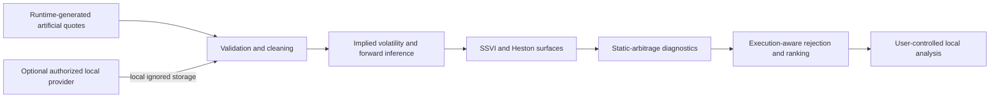

# Heston & SSVI Volatility Surface Lab

[](https://github.com/adamlpolansky/heston-volatility-surface-lab/actions/workflows/ci.yml)
[](LICENSE)
[](pyproject.toml)

An implementation-only Python toolkit for quote validation, volatility-surface construction,
Heston and SSVI calibration, and execution-aware static-arbitrage diagnostics.

This repository contains the implementation only. It provides optional adapters for
user-authorized ThetaData access and a pipeline for quote cleaning, volatility-surface
construction, Heston and SSVI calibration, and execution-aware static-arbitrage diagnostics.
No market data, credentials, calibrated parameters, candidate sets, backtests, reports, or
empirical results are distributed. All provider-backed artifacts remain local and Git-ignored.
The repository makes no claim that an executable arbitrage opportunity exists.

## Features

- Typed option-quote schemas, normalization, liquidity filters, and timestamp alignment.
- Black–Scholes pricing, Greeks, implied-volatility inversion, and numerical checks.
- Heston characteristic-function pricing and bounded calibration objectives.
- SVI/SSVI total-variance parameterization, fitting, and surface diagnostics.
- Put–call parity, vertical, butterfly, and calendar necessary-condition checks.
- Bid/ask-, cost-, liquidity-, and execution-aware candidate rejection and ranking.
- Generic backtesting components and an optional, mock-tested ThetaData adapter.

## Architecture



Provider access is optional. CI, tests, and the default demo follow only the artificial-input
path and do not contact a market-data service.

## Offline quickstart

Use Python 3.12:

```bash
python -m venv .venv
python -m pip install -c constraints/py312.txt -e ".[dev]"
python -m pip check
python -m pytest -q
python -m heston_arb_lab.cli demo
```

Tests construct artificial option chains and surfaces in memory or temporary directories at
runtime. They do not load committed datasets and leave the tracked worktree unchanged.

## What the diagnostics mean

- A **model-relative discrepancy** is a difference from a fitted model. It is not by itself an
  arbitrage violation.
- A **static-arbitrage necessary-condition violation** fails a mathematical price constraint,
  subject to the input assumptions. It is a screening result, not a guaranteed trade.
- An **executable trade** would additionally require contemporaneous executable quotes,
  realistic fills, fees, slippage, financing, borrow, exercise, latency, and operational
  feasibility. This repository does not claim that such a trade exists.

## Optional provider integration

Install adapters separately:

```bash
python -m pip install -c constraints/py312.txt -e ".[providers]"
```

The ThetaData adapter defaults to dry-run behavior. Live use requires the user to set
`THETADATA_API_KEY` in the process environment, instantiate the adapter with `dry_run=False`,
and independently confirm authorization and data rights. Provider outputs must be written only
under ignored local directories such as `work/` or `data/`. Secrets are never printed.

See [provider boundaries](docs/PROVIDERS.md) and
[third-party notices](THIRD_PARTY_NOTICES.md).

## Documentation

- [Architecture](docs/ARCHITECTURE.md)
- [Data contracts](docs/DATA_CONTRACTS.md)
- [CLI and API usage](docs/USAGE.md)
- [Reproducibility](docs/REPRODUCIBILITY.md)
- [Limitations and non-claims](docs/LIMITATIONS.md)

## License

Original project content is licensed under the [MIT License](LICENSE), copyright 2026
Adam Luboš Polanský. Provider services, client libraries, and market data remain subject to
their respective terms and licences.
