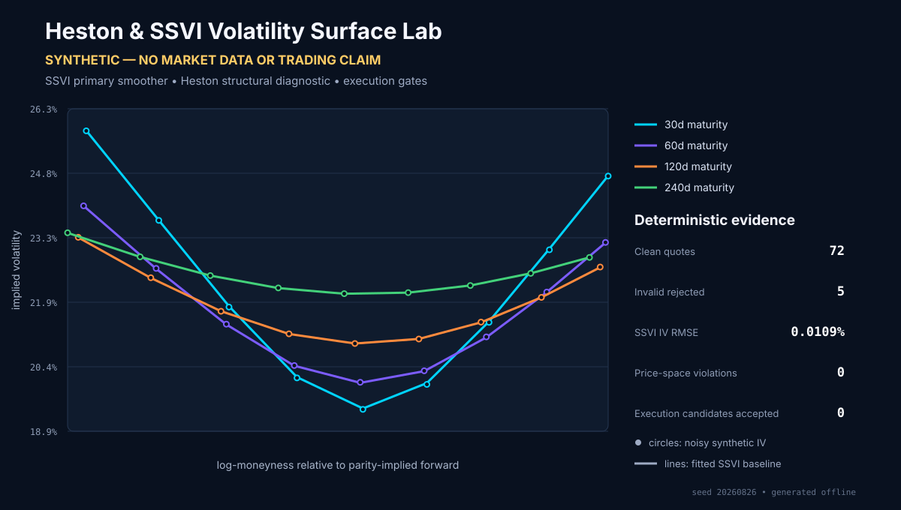
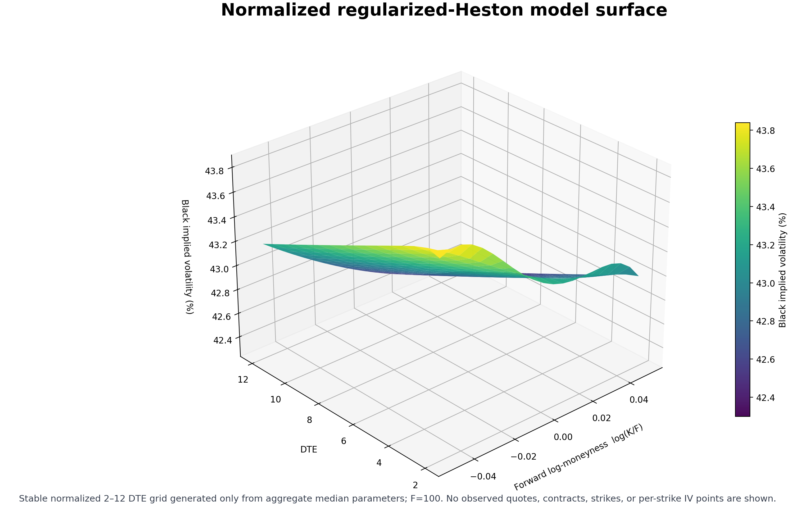
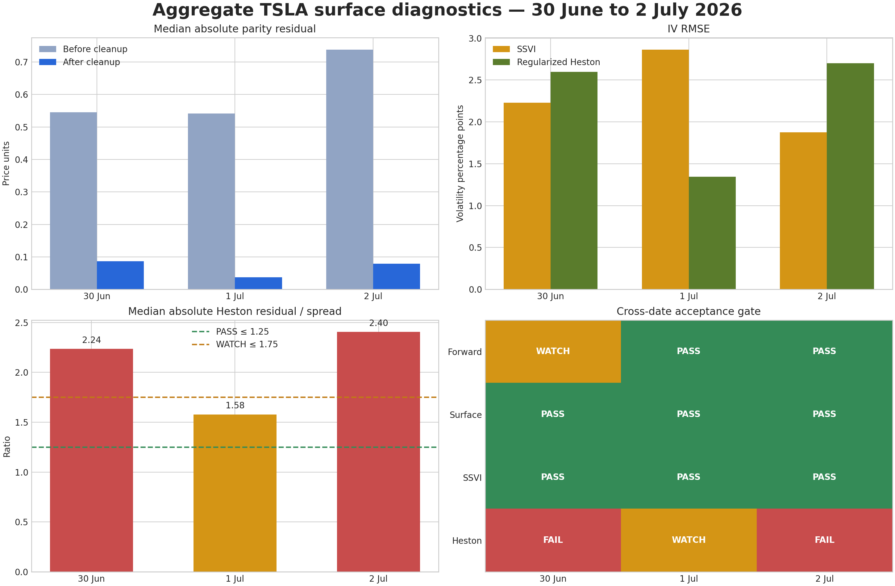

# Heston & SSVI Volatility Surface Lab

End-to-end options-surface research framework covering quote validation, option-implied
forwards, IV inference, SSVI smoothing, Heston calibration and execution-aware arbitrage
diagnostics.



```bash
python -m heston_arb_lab.cli synthetic-evidence
```

| Deterministic result (seed `20260826`) | SYNTHETIC evidence |
|---|---:|
| Generated / clean quote rows | 77 / 72 |
| Deliberately invalid rows rejected | 5 / 5 |
| Parity-implied forwards | 4 expiries; 0.000000 bps max error (expected by construction: the shared call/put midpoint perturbation cancels in `C - P`) |
| Robust IV inversions | 72 / 72; 0.00005146 RMSE |
| Primary SSVI surface recovery | 0.00010862 IV RMSE; 0 condition failures |
| Heston structural calibration | 12 points; 0.245983 price RMSE |
| Fitted-price static-arbitrage flags | 0 |
| Residual candidates rejected by execution gates | 8 / 8; 0 accepted |

The `0.000000 bps` forward error is a pipeline invariant: each matched call and put receives
the same synthetic midpoint perturbation, which cancels exactly in `C - P`. It validates the
parity-forward implementation; it is not a claim of statistical estimation accuracy on noisy
market data.

> **DETERMINISTIC SYNTHETIC DEMO.** The evidence above contains no market data or
> provider-derived output. A separately isolated, permissioned aggregate case study is
> documented below. Neither evidence track makes a profitability or executable-trading claim.

[](https://github.com/adamlpolansky/heston-volatility-surface-lab/actions/workflows/ci.yml)
[](LICENSE)
[](pyproject.toml)

## What this demonstrates

The fixed-seed evidence pack runs one synthetic chain through the complete publication path:

1. strict row-schema validation and quote-quality rejection;
2. forward inference from matched calls and puts using put-call parity;
3. bounded Black–Scholes implied-volatility inversion;
4. SSVI fitting and recovery against known synthetic surface parameters;
5. reduced Heston calibration as a structural diagnostic;
6. strike, vertical-spread and butterfly checks on fitted prices;
7. model-residual-to-bid/ask-spread measurement; and
8. fees, spread cost and cost-buffer rejection gates.

SSVI is the **primary surface smoother and baseline**. Heston is an independently specified
**structural diagnostic model**. Neither model is an automatic trading signal.

The generator uses four maturities, nine strikes, both option rights, controlled fixed-seed
midpoint noise and observable bid/ask spreads. It appends five deliberately invalid rows: a
crossed market, a negative bid, a missing ask, an unknown option right and a negative strike.
Only aggregate evidence is committed; quote rows are never written.

## Three different claims

- A **model-relative residual** is the difference between a quote midpoint and a fitted-model
  price. It can be ordinary model error and is not an arbitrage statement.
- A **static-arbitrage flag** is a failed mathematical price constraint under the diagnostic's
  assumptions. It remains a screening result, not proof of a fillable trade.
- An **executable opportunity** would additionally survive contemporaneous bid/ask prices,
  realistic fills, fees, slippage, financing, borrow, exercise, latency and operational risk.
  This repository reports none.

## Reproduce offline

Use Python 3.12. The default installation excludes all provider clients.

```bash
python -m venv .venv
python -m pip install -c constraints/py312.txt -e ".[dev]"
python -m pip check
python -m heston_arb_lab.cli synthetic-evidence
python -m pytest -q
python -m ruff check .
python -m ruff format --check .
python -m mypy src
```

The regeneration command rewrites only the labelled aggregate
[`synthetic_evidence.json`](docs/assets/synthetic_evidence.json) and
[`synthetic_evidence.svg`](docs/assets/synthetic_evidence.svg). CI regenerates them and fails
if bytes differ. The demo, test suite and CI make no provider request and require no credential.

## Approved aggregate real-data evidence

A separately isolated case study contains only the frozen, permissioned aggregate Heston/SSVI
outputs for TSLA options from 30 June through 2 July 2026. It contains no raw or processed quote
rows, individual contracts, actual strikes, NBBO observations, bid/ask values or sizes, API
responses, caches, per-strike IV or fitted values, ranked candidates, or detailed trade cases.

Options market data provided by Theta Data (https://www.thetadata.net).

This project is independent research by the author and is not reviewed, endorsed or sponsored by Theta Data.

### Normalized regularized-Heston model surface



Options market data provided by Theta Data (https://www.thetadata.net).

This figure is constructed from the five published aggregate median parameters using normalized
`F=100`, log-moneyness and a stable 2–12 DTE grid. It does not contain the observed option grid,
actual strikes, contracts, quotes or per-strike implied volatility.

### Aggregate out-of-time diagnostics



Options market data provided by Theta Data (https://www.thetadata.net).

### Approved aggregate tables

[`03_oot_aggregate_table.csv`](docs/thetadata_approved/heston_tsla_2026-06-30_to_2026-07-02/03_oot_aggregate_table.csv)

Options market data provided by Theta Data (https://www.thetadata.net).

[`04_model_comparison_table.csv`](docs/thetadata_approved/heston_tsla_2026-06-30_to_2026-07-02/04_model_comparison_table.csv)

Options market data provided by Theta Data (https://www.thetadata.net).

[`05_parameter_summary.csv`](docs/thetadata_approved/heston_tsla_2026-06-30_to_2026-07-02/05_parameter_summary.csv)

Options market data provided by Theta Data (https://www.thetadata.net).

[`06_acceptance_gate.csv`](docs/thetadata_approved/heston_tsla_2026-06-30_to_2026-07-02/06_acceptance_gate.csv)

Options market data provided by Theta Data (https://www.thetadata.net).

[`07_audit_summary.csv`](docs/thetadata_approved/heston_tsla_2026-06-30_to_2026-07-02/07_audit_summary.csv)

Options market data provided by Theta Data (https://www.thetadata.net).

See the [approved evidence index](docs/thetadata_approved/heston_tsla_2026-06-30_to_2026-07-02/README.md)
and [data provenance and public/private boundary](docs/thetadata_approved/heston_tsla_2026-06-30_to_2026-07-02/08_data_provenance_and_public_private_boundary.md).

## Public boundary

The reproducible software-validation path remains entirely synthetic and provider-independent.
The only provider-derived materials are the exact frozen aggregate artifacts in the isolated
approved-evidence directory above. No raw or processed rows, individual contracts, actual
strikes, NBBO, bid/ask observations, API responses, cache, per-strike observations or
downloadable market dataset is published. The optional adapter remains outside the public demo
and CI paths, which issue no provider request and require no credential.

See the [public-data policy](docs/PUBLIC_DATA_POLICY.md), [methodology](docs/METHODOLOGY.md),
[limitations](docs/LIMITATIONS.md), [architecture](docs/ARCHITECTURE.md), and
[reproducibility guide](docs/REPRODUCIBILITY.md).

## License and author

The [MIT License](LICENSE) applies to the author's source code and materials explicitly labelled
synthetic, copyright 2026 Adam Luboš Polanský. The approved Theta Data-derived aggregate
artifacts are not offered under the MIT License. Their publication relies on personal,
non-commercial and non-transferable written permission granted to Adam Luboš Polanský for this
specific study. No right is granted to third parties to sublicense or redistribute those
provider-derived artifacts. The approved aggregates may remain public after the subscription
ends, while all permanent exclusions stated above continue to apply.
